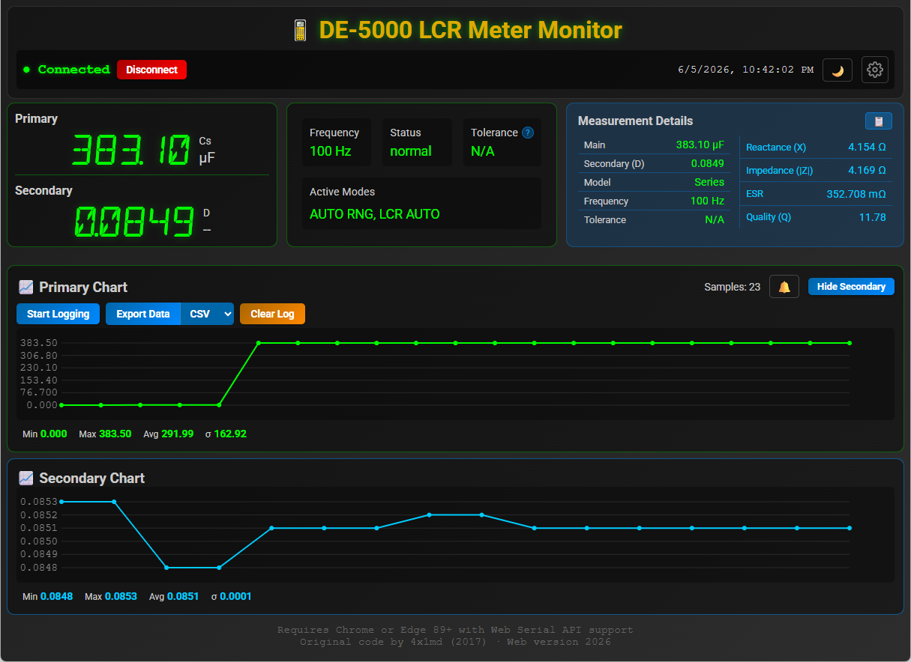

#  DE-5000 LCR Meter Monitor

Real-time monitoring software for the **DER EE DE-5000 LCR Meter**, available as both a web app and a native desktop app.

[](https://codecov.io/github/Arcturus808/de5000)


## Apps

| App | Stack | Serial Access | Push Notifications | Portability |
|-----|-------|---------------|-------------------|-------------|
| [**de5000-svelte**](./de5000-svelte) | SvelteKit SPA | Web Serial API (Chrome/Edge) | Any ntfy server (fetch-based) | Runs in browser |
| [**de5000-tauri**](./de5000-tauri) | Tauri v2 (Rust + SvelteKit) | Native serial (Rust `serialport`) | Embedded ntfy-rs server | Single portable executable (~8 MB) |

### Screenshots

| Desktop App (Tauri) | Web App (Svelte) |
|:---:|:---:|
|  |  |

Both apps share the same SvelteKit frontend architecture, tabular measurement details, customizable typefaces/colors, dual real-time charts, data logging, alert thresholds, and CSV/Excel/JSON export.

## Features

- **Real-time measurement display** — primary and secondary values
- **Tabular measurement details** — measured values alongside calculated values (reactance, impedance, ESR, Q, D)
- **Customizable typefaces** — Courier New, Poppins, Roboto, Open Sans, LED Segment with live preview
- **Customizable colors** — curated palette dropdowns with custom color support
- **Dual charts** — primary (green) and secondary (cyan) real-time canvas charts with inline stats
- **Alerts** — configurable high/low thresholds with Web Audio alarm and visual flash
- **Push notifications** — instant alerts to your phone via ntfy
- **Tooltips** — info icons with detailed descriptions of measurement parameters
- **Data logging & export** — CSV, Excel (.xlsx), JSON
- **Measurement modes** — Auto Range, LCR Auto, Delta, Calibration, Sorting, Parallel

## Quick Start

### Web App (Chrome/Edge)

```bash
cd de5000-svelte
npm install
npm run dev
```

Open in Chrome 89+ or Edge 89+ (Web Serial API required).

### Desktop App (Windows / macOS / Linux)

```bash
cd de5000-tauri
npm install
npm run tauri dev
```

See [de5000-tauri/README.md](./de5000-tauri) for build prerequisites (Rust toolchain).

## Hardware

The DE-5000 connects via an IR-to-USB adapter using a CH340E USB-to-serial chip. See the app READMEs for wiring details and adapter setup.

## Repository Structure

```
de5000/
├── de5000-svelte/       # SvelteKit web app
├── de5000-tauri/        # Tauri desktop app (Rust backend + SvelteKit frontend)
├── de5000-icon-set/     # App icon generation scripts and source assets
└── img/                 # README images (adapter photos, templates)
```

## License

MIT
