#  DE-5000 LCR Meter Monitor

A desktop application for real-time monitoring of the **DER EE DE-5000 LCR Meter** via USB serial connection.

Built with [Tauri v2](https://tauri.app/) (Rust backend) and [SvelteKit](https://kit.svelte.dev/) (frontend).

[](https://codecov.io/gh/Arcturus808/de5000)


  

## Features

- **Real-time measurement display** — primary and secondary values
- **Tabular measurement details** — measured values (main, secondary, model, frequency, tolerance) alongside calculated values (reactance, impedance, ESR, Q, D) derived from the measurement
- **Customizable typefaces** — choose display and readout fonts (Courier New, Poppins, Roboto, Open Sans, LED Segment) with live preview; all fonts bundled locally (offline)
- **Customizable colors** — curated palette dropdowns (Primary, Secondary, Neutral) with custom color naming and storage
- **Serial port selector** — inline in header with auto-detection of USB serial devices, colored status dot
- **Data logging** — record measurements with timestamps
- **Dual charts** — primary (green) and secondary (cyan) real-time canvas charts, each showing last 60 readings with inline stats
- **Alerts** — configurable high/low thresholds with Web Audio alarm and visual flash
- **Push notifications** — instant alerts to your phone via embedded ntfy-rs server, with iOS support via APNS relay through ntfy.sh
- **Export** — save logged data as CSV (default), Excel (.xlsx), or JSON via native save dialog
- **Measurement modes** — displays active modes (Auto Range, LCR Auto, Delta, Calibration, Sorting, Parallel)
- **Tooltips** — info icons with detailed descriptions of measurement parameters
- **Portable** — single executable, no installation required (~7 MB)

## Screenshot

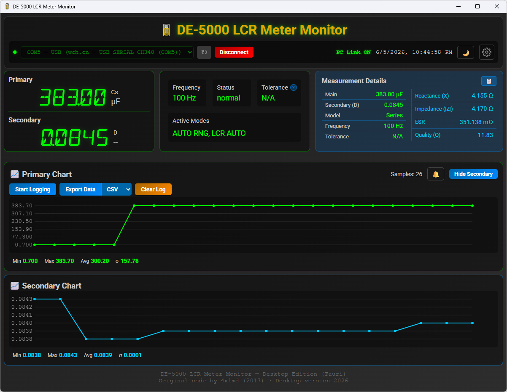

## Requirements

### To Run
- **Windows:** Windows 10/11 (WebView2 runtime pre-installed)
- **macOS:** macOS 12+ (Monterey or later)
- **Linux:** Ubuntu 22.04+ / Debian 12+ / Fedora 39+ (WebKitGTK required)
- DE-5000 LCR Meter connected via USB serial adapter

### To Build
- [Rust toolchain](https://rustup.rs/) (v1.70+)
- [Node.js](https://nodejs.org/) (v18+)
- npm
- **macOS:** Xcode Command Line Tools (`xcode-select --install`)
- **Linux:** System libraries (see below)

## IR to USB Adapter

Instead of purchasing the official DE-5000-USB interface module, you can build your own adapter with an IR phototransistor, pullup resistor, and CH340E USB-to-serial module. You don't even need to 3D print anything — just cut a piece of plastic to size and mount the phototransistor to it with hot glue. The adapter consists of two parts: the photosensor unit and the CH340E module, connected by a two-conductor cable or miniature coax.

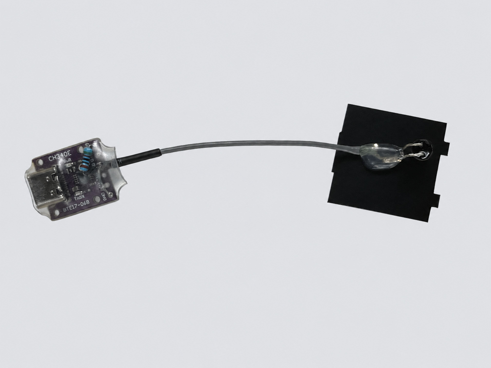

At the rear of the DE-5000, the photosensor unit fits into the IR port's square pocket and is held in place with tabs. The phototransistor picks up the IR signal and triggers RXD of the CH340E, which sends the signal to a COM port.

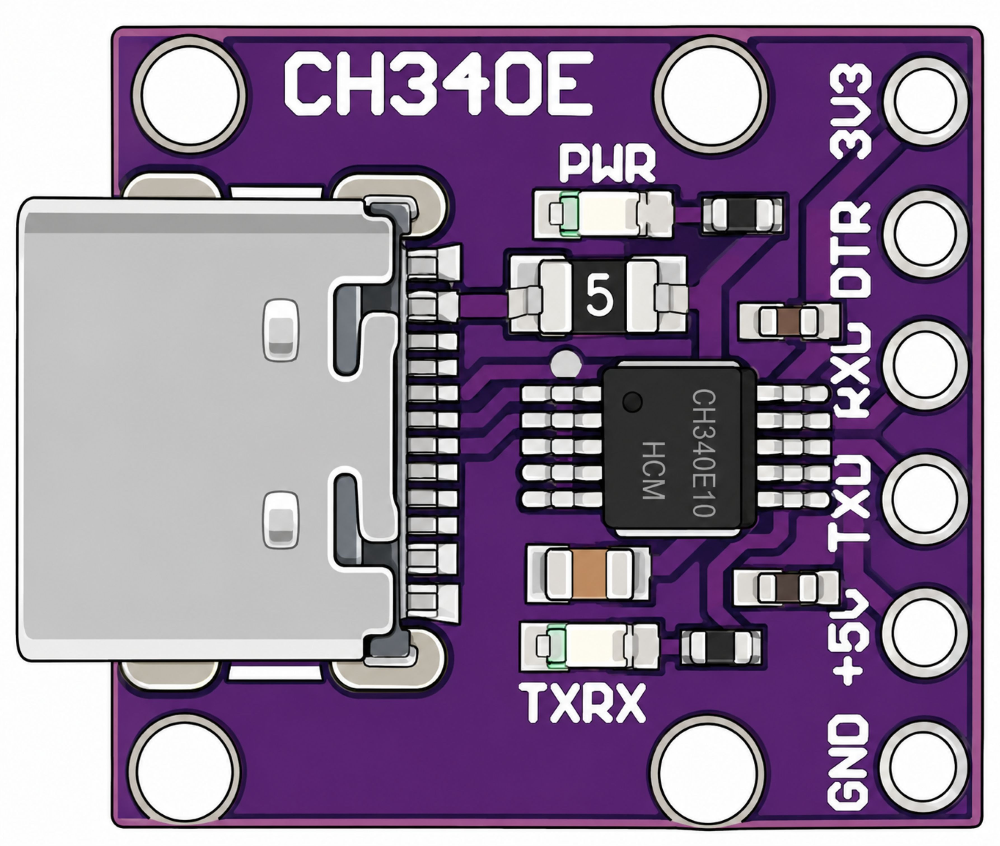

The phototransistor is 5 mm with black daylight filter and 940 nm sensitivity.

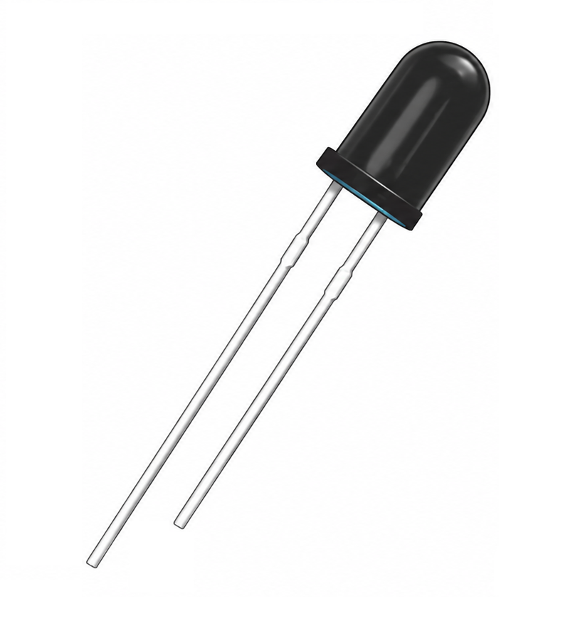

**Phototransistor wiring:**
- Collector lead → RXD
- Emitter lead → GND
- 510 Ω pullup resistor between 3V3 and RXD

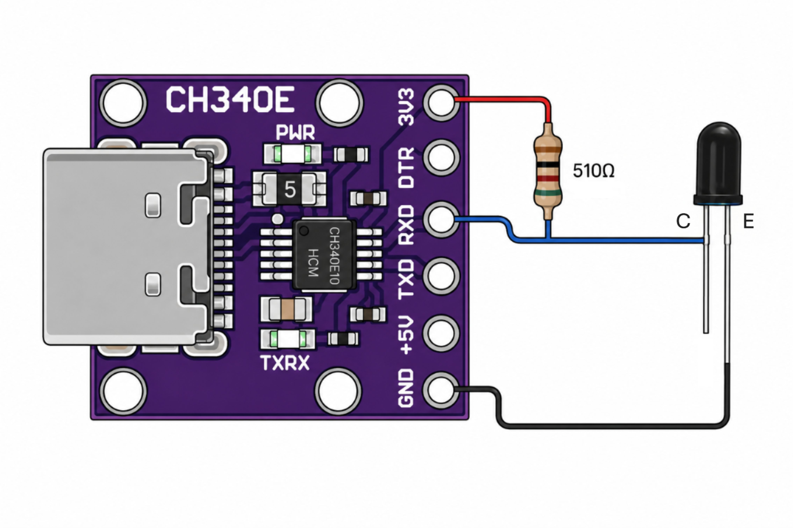

### Sensor Unit

Fabricate the sensor unit base from a thin, flat piece of flexible plastic (old loyalty cards, snack can lids, etc.) Punch a hole in the base so the IR can hit the sensor. If you make the bottom tab small enough, the base snaps into place in the meter and holds the sensor securely — while still allowing easy removal.

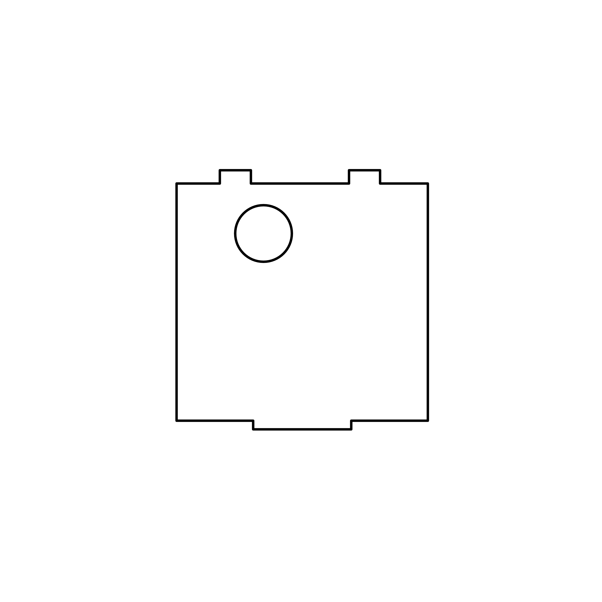

[Download the sensor unit template (PDF)](../img/template.pdf)

> **Printable template:** Print at actual size / 100% scale. Do not select "Fit to Page" in the print dialog.
> - **Chrome:** More settings → Scale → Default or Custom 100%
> - **Edge:** More settings → Actual size
> - **Firefox:** More settings → Scale → 100%

Bend the leads of the phototransistor so it's pointing toward the hole.

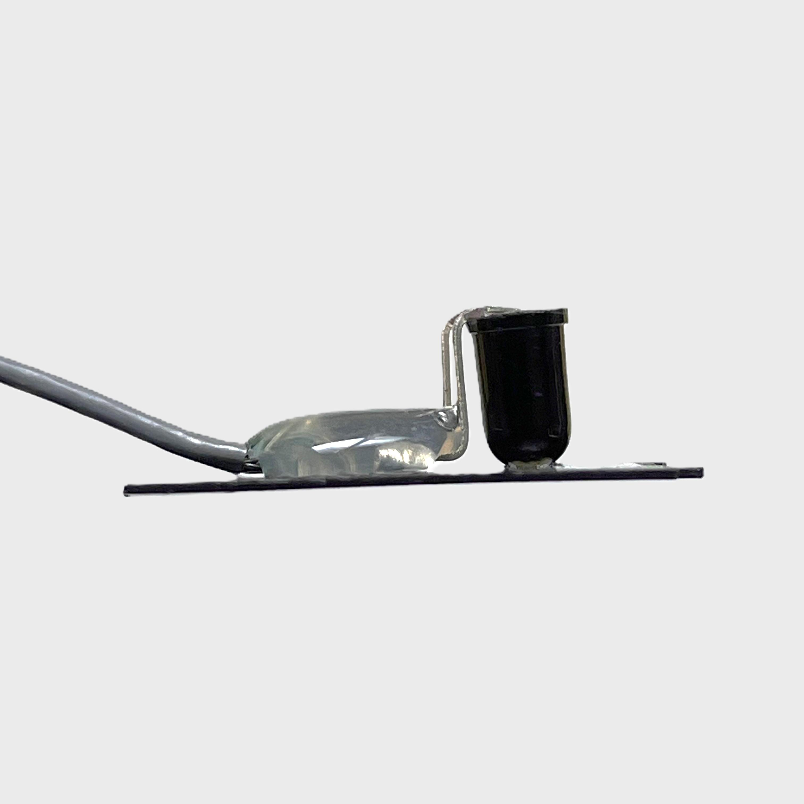
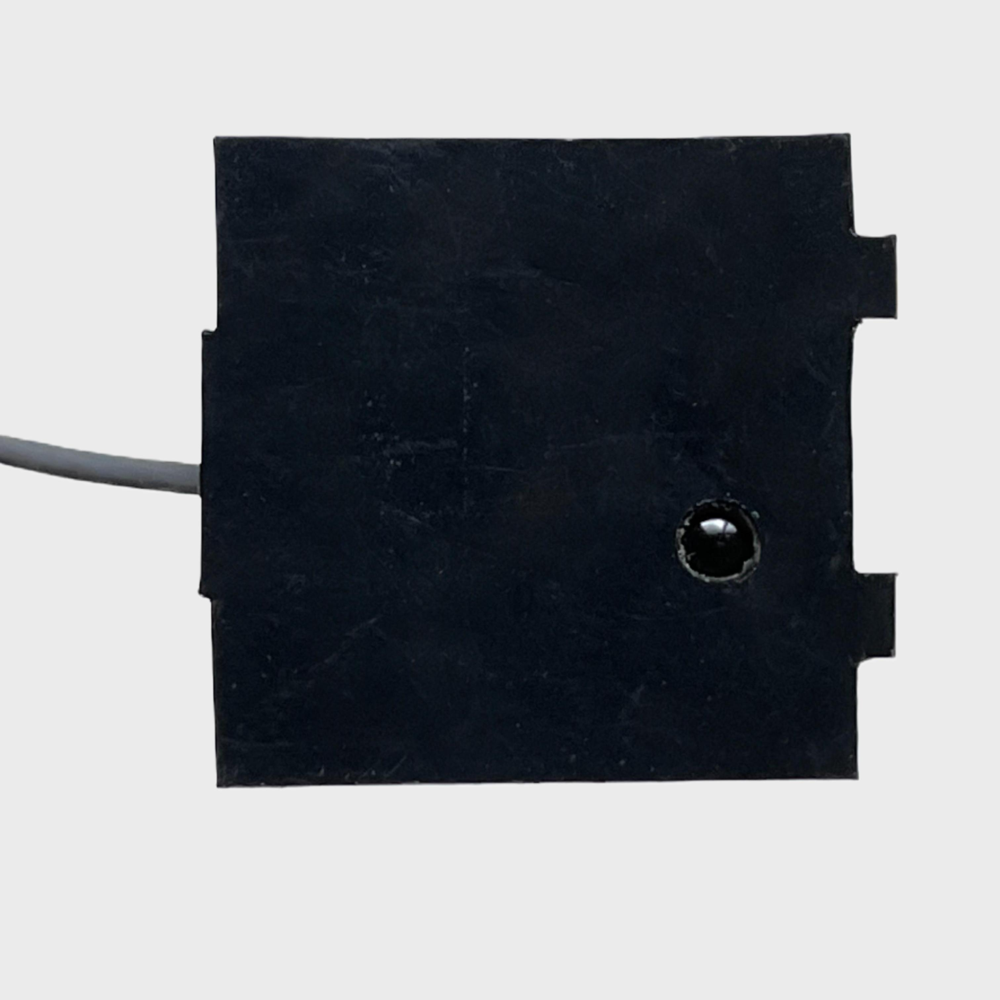

Solder a two-conductor cable to the leads and hot-glue the joint to the base.

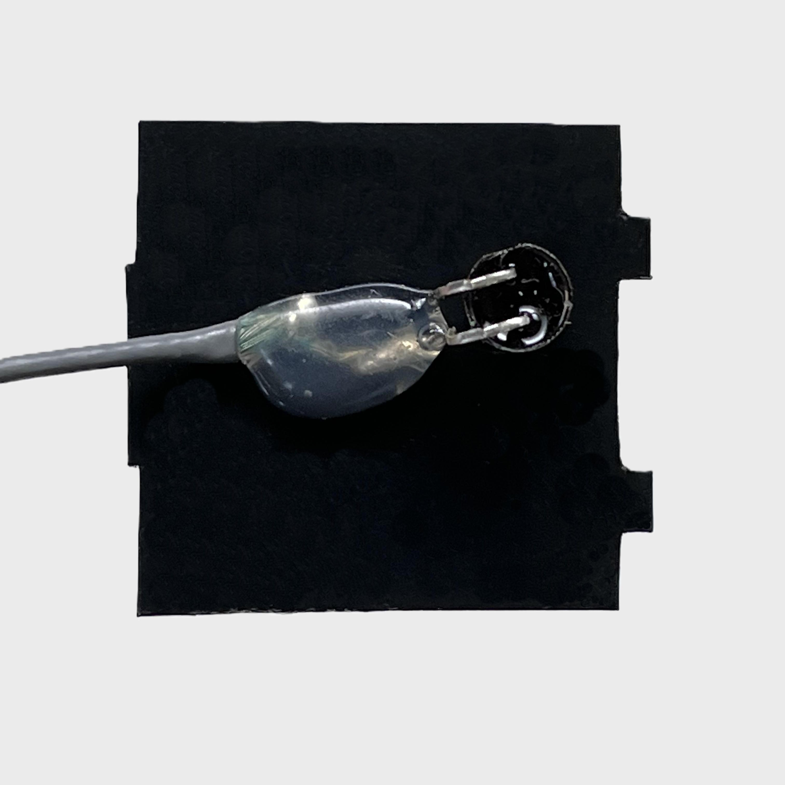
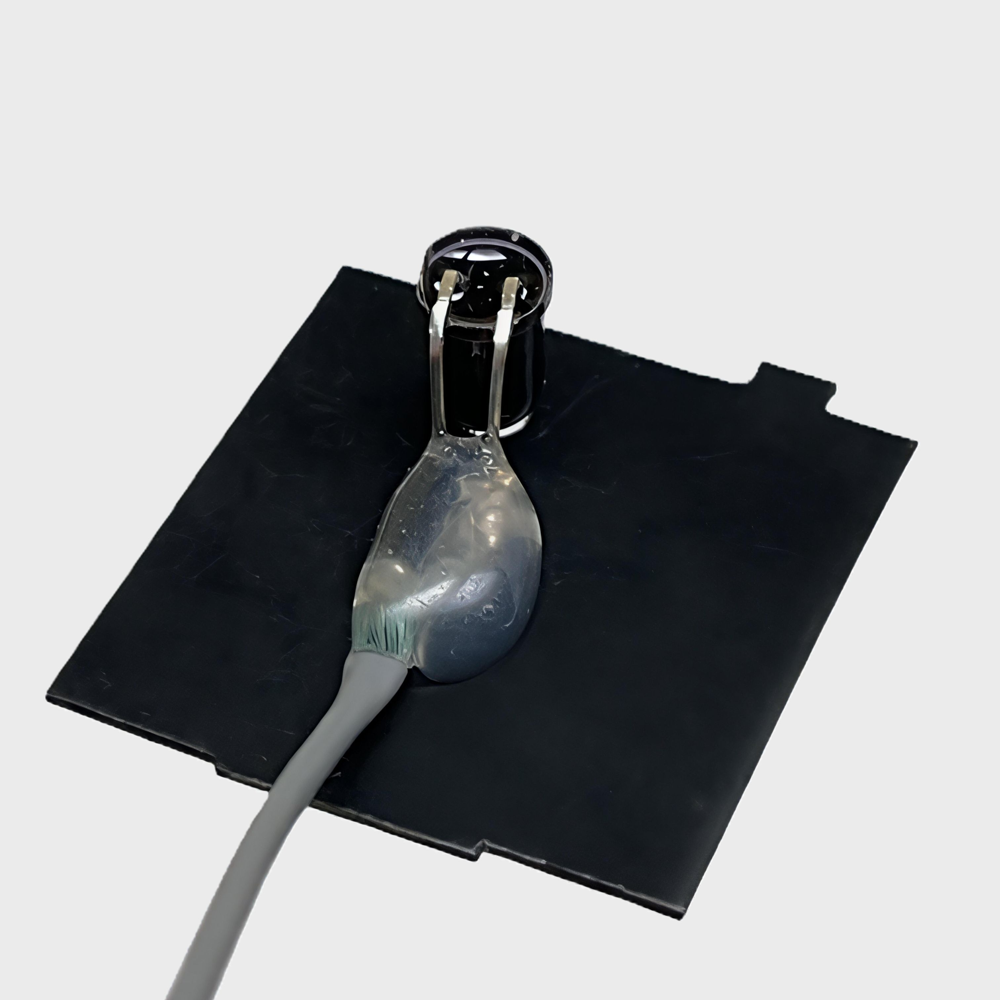

Protect the USB module with clear heat shrink.

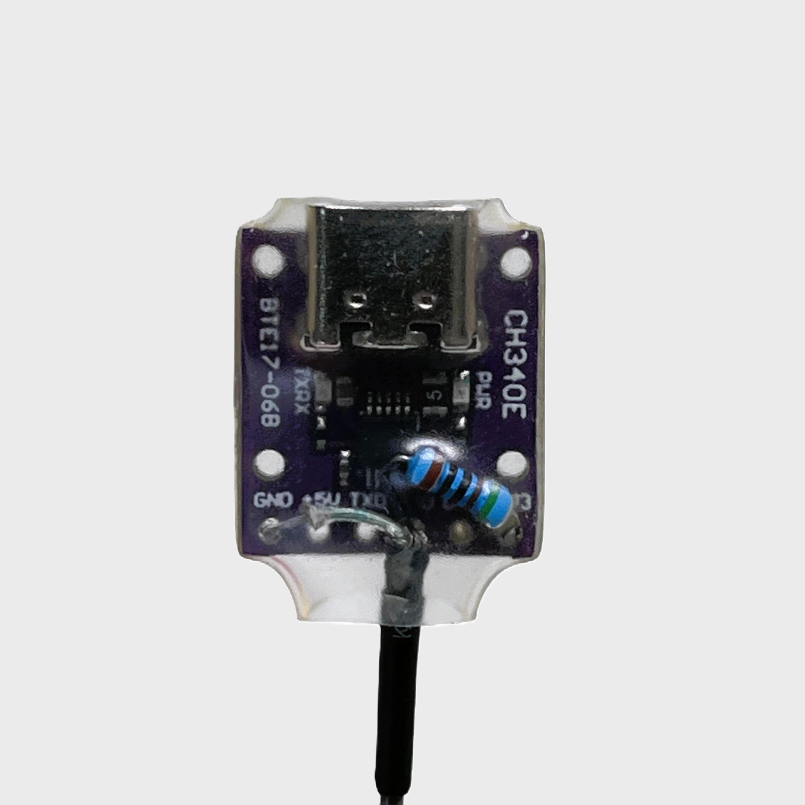

## Quick Start

Download the latest release from [Releases](../../releases):
- **Windows:** `de5000-tauri.exe` — no installation needed
- **macOS:** `de5000-tauri.app` — move to Applications folder
- **Linux:** `de5000-tauri_*.AppImage` — make executable and run

> **macOS:** On first launch, right-click the app → Open to bypass Gatekeeper (the app is not notarized). This is only needed once.

> **Linux:** After downloading the AppImage, run `chmod +x de5000-tauri_*.AppImage` then `./de5000-tauri_*.AppImage`.

1. Connect your DE-5000 to your PC via USB serial adapter
2. Launch the application
3. Select the serial port from the dropdown (click ↻ to refresh)
4. Click **Connect**
5. Measurements will appear in real-time

## Building from Source

### Setup

```bash
# Install npm dependencies
npm install
```

**Windows only** — Add Defender exclusion to prevent build file-locking issues (run as admin):
```powershell
Add-MpPreference -ExclusionPath "<project-path>\src-tauri\target"
```

**macOS only** — Install Xcode Command Line Tools (if not already installed):
```bash
xcode-select --install
```

**Linux only** — Install system dependencies:
```bash
# Ubuntu / Debian
sudo apt install libwebkit2gtk-4.1-dev libgtk-3-dev libayatana-appindicator3-dev libudev-dev libssl-dev

# Fedora
sudo dnf install webkit2gtk4.1-devel gtk3-devel libappindicator-gtk3-devel systemd-devel openssl-devel
```

### Development

```bash
npm run tauri dev
```

Opens the app with hot-reload for frontend changes.

> **Note:** The Vite dev server also runs at `http://localhost:5173` in a regular browser, but the Tauri IPC bridge (`window.__TAURI_INTERNALS__`) is only available inside the Tauri WebView. The frontend code detects this and silently skips IPC calls when not in a Tauri context, so the browser preview will show an empty port list but no errors.

### Production Build

```bash
# Windows: portable .exe only
npx tauri build --no-bundle

# macOS: .app bundle
npx tauri build

# Linux: AppImage + .deb
npx tauri build
```

Output:
- **Windows:** `src-tauri/target/release/de5000-tauri.exe`
- **macOS:** `src-tauri/target/release/bundle/macos/de5000-tauri.app`
- **Linux:** `src-tauri/target/release/bundle/deb/de5000-tauri_*.deb` and `src-tauri/target/release/bundle/appimage/de5000-tauri_*.AppImage`

## Architecture

```
┌─────────────────────────────────────────┐
│             Tauri Window                │
│  ┌───────────────────────────────────┐  │
│  │       SvelteKit Frontend          │  │
│  │  Components ← Stores ← IPC       │  │
│  └──────────────┬────────────────────┘  │
│                 │ invoke / listen        │
│  ┌──────────────┴────────────────────┐  │
│  │         Rust Backend              │  │
│  │  serial.rs → serialport → USB     │  │
│  │  notify.rs → ntfy-rs server → LAN   │  │
│  └───────────────────────────────────┘  │
└─────────────────────────────────────────┘
```

The Rust backend handles all serial communication via the `serialport` crate, and runs an embedded ntfy-rs server for push notifications. Validated 17-byte data packets are streamed to the frontend via Tauri events, where they are parsed using the Cyrustek ES51919 protocol.

### IPC Commands

| Command | Description |
|---------|-------------|
| `list_ports` | Returns available serial ports |
| `connect` | Opens a serial port and starts the read loop |
| `disconnect` | Stops the read loop and closes the port |
| `ntfy_start` | Starts the embedded ntfy-rs server with configured port/topic |
| `ntfy_stop` | Stops the ntfy-rs server |
| `ntfy_status` | Returns running state, port, topic, and subscribe URL |
| `ntfy_publish` | Publishes a push notification via the local ntfy server |

### Serial Configuration

| Parameter | Value |
|-----------|-------|
| Baud Rate | 9600 |
| Data Bits | 8 |
| Parity | None |
| Stop Bits | 1 |
| DTR | true |
| RTS | false |

## Project Structure

```
de5000-tauri/
├── src/                        # SvelteKit frontend
│   ├── static/
│   │   └── fonts/              # Bundled woff2 fonts (offline, no CDN)
│   ├── lib/
│   │   ├── serial/
│   │   │   ├── protocol.js     # ES51919 packet parser
│   │   │   └── connection.js   # Tauri IPC bridge (with dev-mode readiness handling + PC link watchdog)
│   │   ├── stores/
│   │   │   ├── device.js       # Svelte stores
│   │   │   ├── settings.js    # Typeface, color, palette & custom color stores (localStorage)
│   │   │   └── alerts.js      # Alert thresholds, checking, and Web Audio alarm (localStorage)
│   │   ├── utils/
│   │   │   ├── format.js       # Display formatting
│   │   │   ├── export.js       # CSV/Excel/JSON export via native save dialog
│   │   │   └── notify.js      # ntfy server management (Tauri invoke wrappers)
│   │   └── components/         # Svelte UI components
│   │       ├── Header.svelte       # Title + inline port selector/connect + PC Link indicator
│   │       ├── MeasurementCard.svelte # Combined primary/secondary display (stacked)
│   │       ├── MeasurementDetails.svelte # Tabular measured + calculated values
│   │       ├── Chart.svelte       # Dual canvas charts + logging/export/clear + inline stats + alert checking
│   │       ├── AlertModal.svelte  # Alert threshold configuration modal
│   │       ├── Settings.svelte    # Typeface & color customization modal
│   │       ├── TypefaceDropdown.svelte  # Reusable dropdown with in-font preview
│   │       ├── ColorDropdown.svelte    # Color palette dropdown with custom color support
│   └── routes/                 # SvelteKit pages
├── src-tauri/                  # Rust backend
│   ├── src/
│   │   ├── main.rs             # Entry point
│   │   ├── lib.rs              # Tauri setup
│   │   ├── serial.rs           # Serial port logic
│   │   └── notify.rs           # ntfy server management (start/stop/publish)
│   ├── Cargo.toml              # Rust dependencies
│   └── tauri.conf.json         # Tauri configuration
├── package.json                # Node dependencies
└── de5000_tauri_spec.md        # Full specification
```

## Push Notifications (ntfy)

The app embeds an [ntfy-rs](https://github.com/Arcturus808/ntfy-rs) server, enabling instant push notifications to your phone when alerts trigger — no cloud service required. ntfy-rs is included as a Cargo library dependency and compiled directly into the app — the server runs as a background thread, so no separate binary or external process is needed.

The embedded ntfy-rs is compiled with `default-features = false`, stripping out unused server features (email, metrics, TLS, web push, auth, Unix socket, config file) to reduce the binary size by ~10–15 MB. Only the core publish/subscribe + upstream relay features are included.

### How It Works

```
DE-5000 App → Alert triggers → ntfy_publish() → embedded ntfy-rs server → LAN → Phone
```

For iOS, the ntfy server relays poll requests through `ntfy.sh` to trigger APNS, enabling instant delivery despite iOS background restrictions. **An internet connection is required on both the PC and the iPhone** — without internet, iOS notifications will not be delivered (Android works on LAN only). This is unavoidable due to how Apple's push notification system works: iOS apps cannot receive LAN-only push notifications. Only a lightweight poll request is relayed through `ntfy.sh`; no notification content (title, message, priority) is sent to the external server.

### Setup

1. Open **Settings → Push Notifications** and toggle it on
2. Copy the **Subscribe URL** shown (e.g. `http://192.168.0.82:8090/de5000-alerts`)
3. Install the [ntfy app](https://ntfy.sh) on your phone ([iOS](https://apps.apple.com/app/ntfy/id1625396127) / [Android](https://play.google.com/store/apps/details?id=io.heckel.ntfy))
4. In the phone app, set the **Default Server** to `http://<your-PC-IP>:8090`
5. Subscribe to the topic `de5000-alerts`
6. Click **Send Test Notification** to verify the full pipeline

### Windows Firewall

The ntfy server requires inbound TCP access on the configured port (default `8090`). On first launch, Windows Defender Firewall will show a prompt like:

> "Windows Defender Firewall has blocked some features of this app"

- **Check "Private networks"** (your home/work LAN — this is what your phone uses)
- **Uncheck "Public networks"** (coffee shops, hotels — no need to expose ntfy there)
- Click **Allow**

If you accidentally deny or miss the prompt, or if notifications still don't reach your phone, your network may be misclassified. Run these commands in elevated PowerShell:

```powershell
# Ensure your network is classified as Private
Set-NetConnectionProfile -Name "<NetworkName>" -NetworkCategory Private

# Remove any existing ntfy firewall rules (optional cleanup)
Get-NetFirewallRule | Where-Object { $_.DisplayName -like "*ntfy*" -or $_.DisplayName -like "*DE-5000*" } | Remove-NetFirewallRule

# Add firewall rule (list all ports you use)
New-NetFirewallRule -DisplayName "DE-5000 ntfy Server" -Direction Inbound -Protocol TCP -LocalPort 8090,2586 -Action Allow -Profile Private
```

If you change the port in Settings, you must update the firewall rule to include the new port.

### Configuration

| Setting | Default | Description |
|---------|---------|-------------|
| Port | 8090 | HTTP port for the ntfy server |
| Topic | `de5000-alerts` | ntfy topic name for alert messages |
| Once per crossing | On | Only notify once per threshold crossing (resets when value returns within bounds) |

### Notification Format

Notifications include the alert name, measured value, and threshold:

> **DE-5000 Alert** — Primary ≥ 1.023 (threshold 1.0)

### ntfy-rs Server Configuration

The server is configured programmatically via `ntfy_rs::Config` (no CLI flags needed when embedded).

The standalone `ntfy-rs` CLI binary uses these flags:

```
ntfy-rs serve --listen-http :<port> --base-url http://<local-ip>:<port> --upstream-base-url https://ntfy.sh
```

- `--base-url` — Required for iOS; tells the server its own address so poll requests can reference it
- `--upstream-base-url` — Relays iOS poll requests through ntfy.sh → APNS for instant delivery

## Protocol Reference

The DE-5000 uses the **Cyrustek ES51919** chipset protocol. Each data packet is 17 bytes:

| Bytes | Content |
|-------|---------|
| 0–1 | Header (`0x00 0x0D`) |
| 2 | Flags (parallel, auto-range, LCR auto, etc.) |
| 3 | Frequency |
| 4 | Tolerance |
| 5–9 | Primary measurement (quantity, value, units, status) |
| 10–14 | Secondary measurement (quantity, value, units, status) |
| 15–16 | Footer (`0x0D 0x0A`) |

## Troubleshooting

### Antivirus false positives

Some antivirus engines (e.g., Trapmine on VirusTotal) flag the executable as malicious. This is a **false positive** common to apps built with Tauri/Rust that bundle a WebView runtime. The source code is fully open — you can audit it and build from source using the instructions above.

## Credits

- Original serial protocol code by [4x1md](https://github.com/4x1md) (2017)
- DE-5000 LCR Meter by DER EE

## License

MIT
